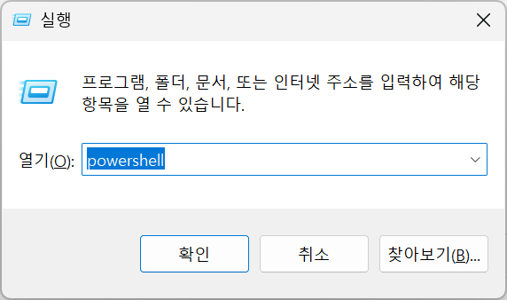
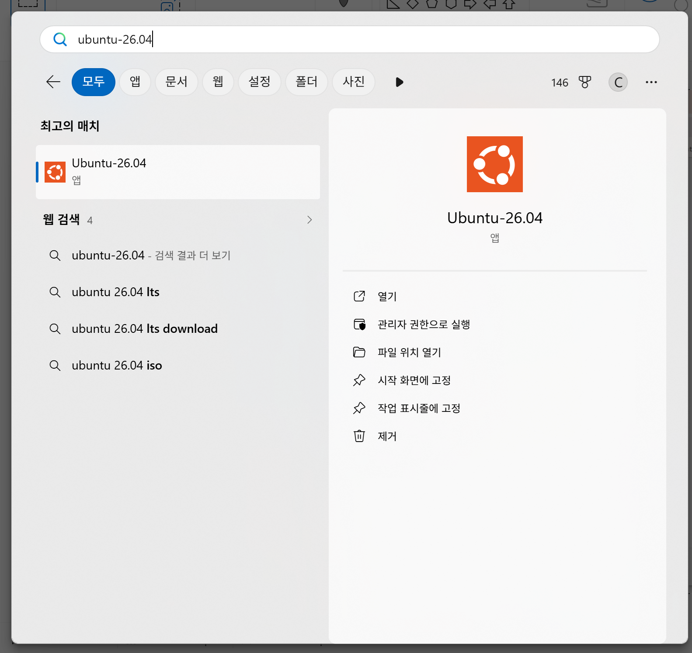
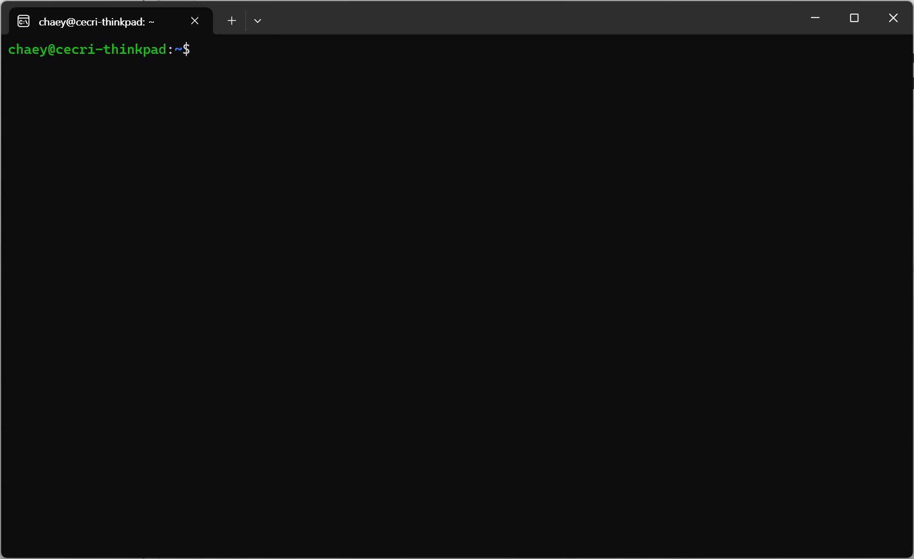

# Homework 0

Throughout the course, we will use GCC version 16. Students are recommended to set up the compiler to their system.

## Windows

The best and easiest way to set up GCC version 16 is to use Windows subsystem for linux (WSL).
First, open your Powershell by pressing &#x229E;+R and enter "powershell".



Within powershell, enter the following command to install
```bat
$ wsl --install -d Ubuntu-26.04
```

After installing it, you will be able to find Ubuntu-26.04.



Running it will give you the following terminal.



Now run the following command in the shell
```bash
$ sudo apt update
$ sudo apt install -y build-essential
$ sudo apt install -y gcc-16
$ sudo apt install -y g++-16
```

The system now has two installed gcc versions (15 and 16). 
```bash
$ gcc --version # This will give 15.X.X
$ gcc-16 --version # This will give 16.X.X
```

To make `gcc-16` the default, we need to run the following commands
```bash
$ sudo update-alternatives --install /usr/bin/gcc gcc /usr/bin/gcc-15 60 --slave /usr/bin/g++ g++ /usr/bin/g++-15
$ sudo update-alternatives --install /usr/bin/gcc gcc /usr/bin/gcc-16 40 --slave /usr/bin/g++ g++ /usr/bin/g++-16
$ sudo update-alternatives --config gcc
```

The last command will give us something like below:
```bash
$ sudo update-alternatives --config gcc
There are 2 choices for the alternative gcc (providing /usr/bin/gcc).

  Selection    Path             Priority   Status
------------------------------------------------------------
* 0            /usr/bin/gcc-15   60        auto mode
  1            /usr/bin/gcc-15   60        manual mode
  2            /usr/bin/gcc-16   40        manual mode

Press <enter> to keep the current choice[*], or type selection number: 
```

Type the number which is for `gcc-16`. For example, for the above case, Selection "2" is for "gcc-16". Thus, type 2 and press enter &#x23CE;.
After that, we will get
```bash
$ gcc --version
gcc (Ubuntu 16-20260322-1ubuntu1) 16.0.1 20260322 (experimental) [trunk r16-8246-g569ace1fa50]
Copyright (C) 2026 Free Software Foundation, Inc.
This is free software; see the source for copying conditions.  There is NO
warranty; not even for MERCHANTABILITY or FITNESS FOR A PARTICULAR PURPOSE.

$ g++ --version
g++ (Ubuntu 15.2.0-16ubuntu1) 15.2.0
Copyright (C) 2025 Free Software Foundation, Inc.
This is free software; see the source for copying conditions.  There is NO
warranty; not even for MERCHANTABILITY or FITNESS FOR A PARTICULAR PURPOSE.
```

## MacOS

MacOS users can install gcc version 16 using [homebrew](https://brew.sh/).
First, open a terminal and enter the following command
```bash
$ /bin/bash -c "$(curl -fsSL https://raw.githubusercontent.com/Homebrew/install/HEAD/install.sh)"
```
Then, follow the "next step" presented in the terminal.

Then
```bash
$ brew install gcc
```
will install the gcc version 16 to a system. Still, it will be installed in `/opt/homebrew/bin`. Without adding it to your terminal, you will run a default `gcc`, which is just `clang`.

Thus, you should run the following lines
```bash
$ cd /opt/homebrew/bin/
$ ln -s gcc-16 gcc
$ ln -s g++-16 g++
$ cd -
$ echo 'export PATH="/opt/homebrew/bin/;$PATH"' >> .zprofile
```

Then, after reopening the terminal, you will get
```bash
$ gcc --version
```

